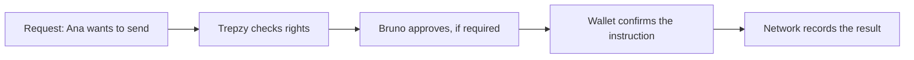

Every outgoing movement on Trepzy passes through four distinct checkpoints before anything reaches the network. Understanding each checkpoint separately — and why none of them replaces the others — is essential for building and supporting Trepzy products correctly.

## The four questions Trepzy asks before moving value

Before any value leaves a wallet, Trepzy works through four questions in sequence:

1. **Who requested it?** Trepzy identifies the person or service that initiated the instruction.
2. **Can they request it?** Trepzy checks whether that person holds the right to perform this action on this account, at this moment.
3. **Do other people need to approve?** Depending on the account type and configuration, a second authorized person may be required to confirm before anything proceeds.
4. **Can the wallet confirm the instruction?** The wallet itself must provide a digital signature that is cryptographically tied to the exact instruction — origin, destination, asset, amount, and network.

These are related steps, but answering one of them does not answer any of the others.

## A concrete example

Ana works at a company and prepares a payment to a supplier. Trepzy first checks whether Ana has the right to initiate payments on that account. The company may then require Bruno, another authorized person, to approve the request. Only after Bruno approves does the wallet confirm the specific instruction via a digital signature. Finally, the underlying network records the result.

<Note>
On a personal account there may be no second human approver — but Trepzy still checks the request, and the wallet still participates in confirming the instruction. The absence of a second approver does not collapse the other three steps into one.
</Note>

## Rules for individuals vs. businesses

The authorization journey for a personal account and the authorization journey for a business account are not interchangeable. Each has its own approval logic, its own team roles, and its own wallet configuration. Never copy a UI pattern or an approval button from one journey into the other without verifying that the underlying rules align.

## Trepzy-side rights vs. wallet control

These two concepts are frequently confused. Keep them separate.

**Trepzy-side rights** mean that the person is permitted to perform a specific action on a specific account right now. Whether that permission exists depends on:

- The person's role in the team or account
- The current state of the account
- The destination of the movement
- Whether an additional identity check has been completed

Trepzy verifies rights before initiating any movement of value.

**Wallet control** is the mechanism by which the wallet itself confirms that the instruction is authorized. That confirmation takes the form of a **digital signature** — a cryptographic proof tied to the exact content of the instruction: origin, destination, asset, amount, and network. If any of those elements changes materially, the authorization must be re-established from scratch.

<Warning>
A person can hold Trepzy-side rights without having wallet control, and can control a wallet without having permission to act on a Trepzy account for a given company. **Both must align for an operation to proceed.** If either side is missing, the operation must stop.
</Warning>

## Interactive signing vs. delegated access

There are two ways a wallet confirms an instruction:

- **Interactive signing:** the person is present in the app and participates in the signing at that exact moment.
- **Delegated access:** the person previously granted a bounded permission for a service to participate in signing on their behalf, under defined conditions.

Delegating access is **not** a blanket acceptance of all future payments. A delegation covers specific, defined conditions. If a scheduled send is involved, the request must preserve the exact value, destination, asset, and timing that were originally authorized. Changing any material element requires a new confirmation from the person.

Trepzy's current direction is to use delegated access as the primary path for both personal and business wallets. Creating, activating, revoking, and recovering delegated access are all separate steps with their own flows.

## Additional confirmation for sensitive actions

For certain sensitive actions, Trepzy may ask the person to prove once more that they are present and authorized — for example, by entering a code or completing another security step. This **additional confirmation** protects that specific action. It does not grant permanent elevated permissions to the user, and it does not change who holds the value.

<Tip>
Always make clear to the person exactly what they are confirming before they complete the additional confirmation step. They should never be asked to authorize something they cannot read or understand.
</Tip>

## What to do when an operation outcome is uncertain

If a person approved an operation but received no response, the correct action is to look up the result of that **same request** — not to repeat the signature or re-send the instruction. Repeating without knowing what happened to the first attempt can produce a duplicate action.

If the wallet cannot confirm the instruction, the operation must remain pending or fail with a clear error. Trepzy must never silently swap the control method that was agreed with the customer.

<Note>
Keep this distinction sharp:
- **Approval** — the action is permitted by the applicable people and rules
- **Digital signature** — the technical proof the network needs to accept the instruction
- **Network confirmation** — what actually happened to the digital value

A subsequent bank transfer will also produce its own separate result on top of these three.
</Note>
