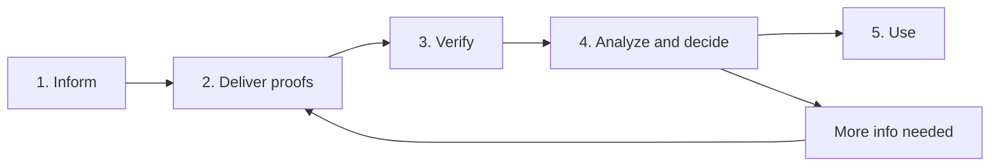

Trepzy and the companies that participate in the customer journey need to know three things before unlocking financial services: who the account holder is, who is permitted to act on their behalf, and what activity will take place. Gathering and validating that information is not a one-time document request — it is an ongoing process with multiple distinct steps, multiple decision-makers, and its own rules about data care.

## Why verification is required

Knowing your customers helps Trepzy prevent misuse, meet applicable regulatory requirements, and protect both customers and the recipients of their transactions. The full set of these checks — including ongoing monitoring and re-verification whenever something material changes — is what we call **compliance**. Compliance is not a checkbox; it is a continuous responsibility.

## The five distinct steps

Every verification journey passes through five events. They are related, but each one is its own distinct moment with its own outcome.

<Steps>
  <Step title="Inform">
    Someone fills in the name, the nature of the activity, and the data of any related persons — for example, the directors or beneficial owners of a company.
  </Step>
  <Step title="Deliver proofs">
    Documents and authorizations are submitted to support the information provided in the previous step.
  </Step>
  <Step title="Verify">
    A specialized company or another authorized source checks the required elements — for example, the identity of a person or the registration status of a business.
  </Step>
  <Step title="Analyze and decide">
    Trepzy applies its own criteria, resolves any inconsistencies, and determines what can be unlocked. A financial partner that will provide a specific service may run its own separate analysis and reach its own separate decision.
  </Step>
  <Step title="Use">
    The specific feature is unlocked when all applicable conditions for that person, account, and service are satisfied.
  </Step>
</Steps>

If the analysis reveals that more information is needed, the flow loops back to **Deliver proofs**. The customer must be told specifically what is missing and who needs to act.

## Three distinctions you must keep clear

<Warning>
These three pairs are frequently confused. Treat them as hard distinctions, not a continuum.

- A **submitted** document ≠ an **approved** document
- A **positive result from a verification company** ≠ **Trepzy's approval**
- **Trepzy's approval** ≠ a **financial partner's acceptance** of the service
</Warning>

Each of these represents a separate decision by a separate party. You cannot infer the outcome of one from the outcome of another.

## What can be automatic vs. what requires a human

Some verification steps can be handled entirely by systems when all conditions are clearly met. Other situations require a human reviewer:

- Information that is internally inconsistent
- Documents of insufficient quality for automated reading
- Uncertainty about who legitimately represents a company

When a case requires human review, Trepzy must record the pending item and communicate to the customer exactly what is missing and who needs to act. A case sitting in human review is not a product failure — leaving a customer without a clear path to resolution is.

<Note>
The current Trepzy direction allows certain cases to proceed automatically when all conditions are fully evidenced. This does not mean the full verification flow is automated today. In the product documentation, each step is marked as automatic, manual, or in preparation, with the observed status noted at the time.
</Note>

## Personal data deserves special care

Documents, biometric images, and identification data are not ordinary transaction metadata. When handling verification data, you must:

- Request only the information the specific purpose requires
- Make it clear to the customer which company will run each check
- Protect access to the data throughout its lifecycle
- Preserve the necessary history of decisions and their rationale

When a customer requests a new service, it may sometimes be possible to reuse a verification proof that is still valid. However, the new service may still require additional information, and it will require its own separate approval decision.
