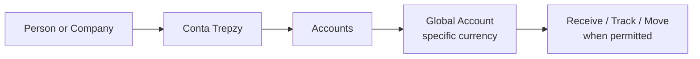

The Trepzy product is organized in layers, and knowing what each layer means prevents confusion when you track a customer's state or debug a missing balance. At the outermost layer sits the **Conta Trepzy** — the primary relationship between a customer (a person or a company) and Trepzy. One level in is **Accounts**, the module focused on receiving, tracking, and moving financial resources. Deeper still is the **Global Account**, a currency-specific account that holds its own resources and conditions. Each layer exists for a reason, and jumping over one will produce gaps in your mental model.

## Conta Trepzy

The Conta Trepzy is the starting point. It represents who the customer is in relation to Trepzy — their identity, their authorizations, and the boundary around their resources. A single person can hold both a personal Conta Trepzy and a role inside a business Conta Trepzy at the same time. These are **completely separate relationships**: separate access, separate resources, and separate rules. Being the owner of a personal Conta does not automatically grant any access to a business Conta, and vice versa.

<Note>
When a team member refers to "the customer's account," always clarify: are they talking about the Conta Trepzy (the customer relationship), or the Global Account (the currency-specific account inside Accounts)? The words overlap in everyday speech but refer to distinct things internally.
</Note>

## Accounts

Accounts is the product module that sits inside the Conta Trepzy. Its purpose is threefold: **receiving** value from outside, **tracking** where that value is and what state it is in, and **moving** value when the customer is permitted to do so. Not every customer will have every capability unlocked at the same time — permissions depend on verification status, the applicable rules for a given rail or currency, and the decisions made by Trepzy and its partners.

## Global Account

Inside Accounts, a **Global Account** is a currency-specific account. The current plan covers three currencies: **USD, EUR, and BRL**. Each Global Account is independent — it has its own receiving details, its own balance, and its own conditions. A USD Global Account is not a EUR Global Account with a different label; the underlying rails, partners, and rules differ.

<Warning>
Not all three currencies are available to all customers today. The multi-currency plan is the direction, but each currency's availability depends on readiness of the relevant rails and partner approvals. Never tell a customer that a currency is available until its status has been confirmed for that customer's profile.
</Warning>

### Currency status at a glance

| Currency | Status |
|----------|--------|
| USD | **In preparation** |
| EUR | **Under study** |
| BRL | **Under study** |

Confirm the current status of each currency with the product team before communicating availability externally.

## Three separate events you must not conflate

One of the most common sources of confusion — both inside the team and for customers — is treating these three events as a single step:

1. **Opening a Global Account** — the customer's account record exists in the system and is associated with a currency.
2. **Having receiving details approved** — a partner (such as BlindPay) has reviewed and issued the actual account details (e.g., a routing number, IBAN, or equivalent) that a sender can use. This step can take time and may be declined.
3. **Seeing a completed deposit** — a value has arrived, been processed, and is reflected as available in the balance. A value that has arrived but has not cleared is **not yet available**.

<Steps>
  <Step title="Open the Global Account">
    The customer completes the necessary steps inside Trepzy to create a Global Account for a specific currency. The account record is created.
  </Step>
  <Step title="Receiving details are approved">
    Trepzy coordinates with the relevant partner to issue valid receiving details for that customer and currency. The partner may impose its own review. Only after approval can the customer share those details with a sender.
  </Step>
  <Step title="A deposit completes">
    An inbound transfer arrives, is processed along the rail, and the balance is updated to reflect an available amount. This is the final confirmation — not a pending notification.
  </Step>
</Steps>

## How the layers relate

The diagram below shows the structural relationship. It is a conceptual map, not a sequence of screens.

<Tip>
When investigating a customer issue, start at the correct layer. A problem with receiving details lives at the Global Account + partner layer. A problem with who can authorize a movement lives at the Conta Trepzy + permissions layer. Starting at the wrong layer wastes time.
</Tip>

## What comes after Accounts

Trepzy also has a **Checkout/Commerce** front end for businesses that sell and collect from their own customers. That module is currently on hold and operates under separate rules. A value collected through Checkout does not automatically become available inside a Global Account without a specific movement. Keep the modules separate in your thinking.
