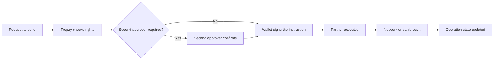

Sending value out of Trepzy is a deliberately gated process. Before a single unit of value moves, two independent conditions must both be satisfied: the person requesting the send must have the right to do so within Trepzy, **and** the wallet that holds the value must be able to confirm the specific instruction through a digital signature. Neither condition substitutes for the other.

## Why both sides must align

Trepzy manages who is permitted to act on an account — that is the **Trepzy-side right**. Separately, the wallet that holds the funds uses a **digital signature** to confirm the exact instruction: the origin, destination, asset, amount, and network. A person may have Trepzy-side permission but lack the wallet control needed to sign. Equally, someone may control a wallet without having permission to use that account under Trepzy's rules. For a send to proceed, both must correspond.

<Note>
For business accounts, there may also be a second-approver requirement before wallet signing is even reached. Check the account's authorisation rules before initiating.
</Note>

## Steps for an outgoing transfer

<Steps>
  <Step title="Verify the right to send">
    Confirm that the customer — or the team member acting on their behalf — has the permission to initiate a send for this specific account, in this currency, to this destination. Trepzy checks this before anything else proceeds.
  </Step>
  <Step title="Check for a second approver (business accounts)">
    If the account belongs to a business and its rules require a second authorised person to approve the operation, that approval must happen before the transfer can move forward. Do not treat a single person's approval as sufficient when the account requires two.
  </Step>
  <Step title="Review the quote presented by Trepzy">
    Before any authorisation is requested, Trepzy presents the full terms of the transfer: the amount, the cost, the destination, and the validity window. Review these carefully. **Authorisation happens after this step**, not before.
  </Step>
  <Step title="Authorise the operation (digital signature)">
    The customer authorises the specific operation as presented. This is a digital signature tied to the exact content shown — origin, destination, asset, amount, and network. If any important element of the transfer changes, authorisation must be sought again.
  </Step>
  <Step title="Trepzy sends to the partner for execution">
    Once authorised, Trepzy passes the instruction to the relevant partner (e.g., BlindPay) for execution. Internally, this may involve digital asset rails; the customer has authorised the economic outcome, not necessarily the technical mechanism used to achieve it.
  </Step>
  <Step title="Partner confirms the result">
    The partner executes the transfer and returns a result to Trepzy. Trepzy updates the operation state based on what actually happened — not on what was requested.
  </Step>
  <Step title="Customer sees the confirmed state">
    The final state is shown to the customer, including if the operation failed. A clear result — even a failure — is more useful than an uncertain one.
  </Step>
</Steps>

## Flowchart: how a send moves through Trepzy

## Important distinctions

<Warning>
A confirmation that the send **request was received** is not a confirmation that the **recipient received the money**. These are different events. Do not communicate a completed send to the customer until the operation state reflects the partner's confirmed result.
</Warning>

<Warning>
If the outcome of a send is uncertain — for example, the customer submitted the request but did not see a clear response — always look up the result of the **original request** before taking any further action. Repeating the operation without knowing what happened to the first one is a real risk of a duplicate send, which can cause direct financial harm.
</Warning>

<Tip>
Sending may use digital asset infrastructure internally. The customer does not need to understand the technical path. What they authorise is the economic outcome: a specific amount leaving their account and arriving at a specific destination.
</Tip>
