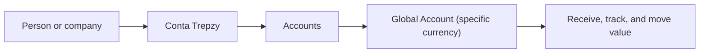

Trepzy is a financial technology company that brings together, in a single experience, everything a person or business needs to receive, hold, and move value across countries, currencies, and payment methods. Today, those tasks are typically scattered across different services — someone switches between apps, repeats information in multiple places, and has to figure out on their own why an operation hasn't finished. Trepzy is built to eliminate that friction.

## The company thesis

The promise to the customer is straightforward: one place for your international financial life. The customer finds a Trepzy experience, chooses what they want to do, reviews the conditions, authorizes when required, and tracks the result. Everything that needs to happen behind that experience — coordination between companies, systems, and rules — stays invisible to them.

<Note>
This is the **direction** of the company. It does not mean every possibility described here is available today for every person, in every country or currency. Each feature is documented with its actual status and conditions.
</Note>

## What Trepzy is — and is not

Trepzy creates the experience the customer uses, holds their information, and organizes each step of an operation. Some services are carried out by **specialized partner companies**. One partner may verify identity, another may provide instruments to hold certain values, another may execute a bank transfer. Trepzy remains responsible for explaining the state of any journey that started on its platform.

**Trepzy is not a bank.** Internally, the team must always be able to identify which financial institution or specialized company is responsible for each service. For the customer, Trepzy shows the conditions, terms, required authorizations, and operation status — without requiring them to learn the partner structure to use the product.

## BlindPay: the main financial partner

For the **first financial paths** Trepzy has chosen to support, **BlindPay is the primary partner**. BlindPay is an external company that provides services for receiving and sending value through different transfer methods, and for moving between bank money and certain digital values, depending on the approved case.

<Warning>
Not all BlindPay options are ready for every Trepzy customer. The documentation covers each capability individually: what BlindPay offers, what Trepzy has decided to use, and what has been confirmed in practice.
</Warning>

## The current focus: Accounts and Global Account

The first product area is called **Accounts** — the part of Trepzy dedicated to receiving, tracking, and moving financial resources. The customer's primary relationship with the company is called the **Conta Trepzy**. A person can have a personal Conta Trepzy and also participate in a company's Conta Trepzy, with separate access and resources for each.

Within Accounts, a **Global Account** is an account organized in a specific currency. The current plan provides for accounts in dollar, euro, and real, each with its own resources and conditions. Opening an account, having a way to receive funds, and seeing a balance available are three distinct steps — not one.

<Note>
This diagram shows **how the concepts relate**, not a promise that all three currencies and all operations are already live. The Global Account section of this knowledge base separates what has been decided, what is being prepared, and what has been confirmed in practice.
</Note>

## What is deferred

<CardGroup cols={2}>
  <Card title="Checkout / Commerce" icon="cart-shopping">
    Trepzy also has a front for businesses to present a sale and collect from their customers. This is called **Checkout** or **Commerce** internally. It is currently **In preparation** (on standby) while the Global Account is being established. A sale and the money held in a Global Account are different things — moving value between them requires a specific operation with its own rules.
  </Card>
  <Card title="Cards and Yield Products" icon="credit-card">
    Ideas such as cards or ways to earn yield on a balance require their own decisions — format, responsible company, cost, and timing. These are **Under study** and are not presented in this documentation as available features simply because they appear in a commercial presentation or because a partner could theoretically provide them.
  </Card>
</CardGroup>

## Three ideas to carry forward

<Steps>
  <Step title="Reduce the work of combining services">
    Trepzy's goal is to reduce the effort required to combine multiple financial services to complete an international operation. The customer should not need to stitch things together themselves.
  </Step>
  <Step title="Simple for customers, understood by the team">
    The customer uses a simple Trepzy experience. The team needs to understand the rules, responsibilities, and states that sustain that simplicity. The partner maps in this knowledge base represent internal knowledge — they are not the screen-by-screen flow the customer has to follow.
  </Step>
  <Step title="First focus is Accounts and Global Account">
    The larger company vision is recorded, but it does not occupy the initial learning path with products that are on standby or under study. Start with Accounts and Global Account.
  </Step>
</Steps>
