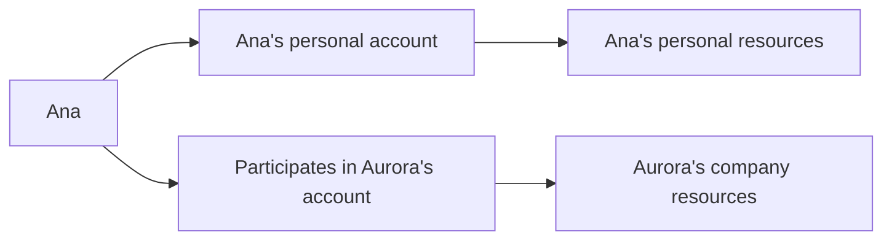

Trepzy serves **people** and **businesses** that need to receive, track, or move value in an operation that crosses countries, currencies, or payment methods. Current work pays special attention to those who receive from outside Brazil and then need to continue using that value. The exact features available depend on each customer's situation — this page introduces the people involved without implying that every form of movement is already live.

## Individual customers

Consider Ana: she works independently, and she can open a personal relationship with Trepzy, submit the information required to be verified, and use the features approved for her profile. If Ana also works at a company, that fact does not mix her personal money with the company's money. The fact that she logs in with the same credentials does not change who holds each account — personal and business contexts remain completely separate.

## Business customers

Consider Aurora, a company. Aurora must inform Trepzy who the company is, what it does, and which people can represent it or use its resources. One person may fill in the initial registration data. A different person may hold the formal authorization to act on the company's behalf. Others may have access to monitor activity or prepare operations. Depending on the action, an additional approval may be required before any value moves. The **account and its resources belong to the company**, even if one of those people leaves the team.

## Participants and their roles

Many people can touch a Trepzy account without being its holder. The table below lists the participants you will encounter and what you must not assume about them.

| Participant | What they can do | What we must not assume |
|---|---|---|
| **Person who initiates registration** | Starts the account opening and provides initial information. | They do not become the permanent decision-maker for everything that follows. |
| **Company representative** | Confirms information or accepts terms within a valid authorization. | A job title written on a form does not, by itself, prove authorization. |
| **Team member** | Views, prepares, or approves an action based on the access they were granted. | An invitation to the account does not open all resources. |
| **Counterparty (sender or recipient)** | Is the other end of a transfer operation. | Their data must match the conditions of that specific service. |
| **Trepzy team** | Monitors pending items, analyzes cases, and supports the customer. | The team does not substitute for authorizations that must come from the account holder. |
| **Partner company** | Verifies information or executes a specific financial step. | One partner company does not automatically decide on behalf of all other companies involved. |

## One person, multiple roles

The same person can hold more than one role at the same time. Ana can be the holder of her own personal account and also a participant in Aurora's account. Even so, every action must be evaluated **in the correct account**, with the authorization required for that specific moment. Switching to a different account on the screen does not transfer funds or grant new permissions.

## The key rule

<Warning>
**Being close to an account is not the same as being its holder or having the ability to move its resources.** Always verify who the actual holder is and what authorization is required before assuming that access equals control.
</Warning>

<Tip>
When you are building or reviewing a journey, ask: whose account is this action happening in, and does the person taking the action hold the right authorization for this specific step in this specific account context?
</Tip>
